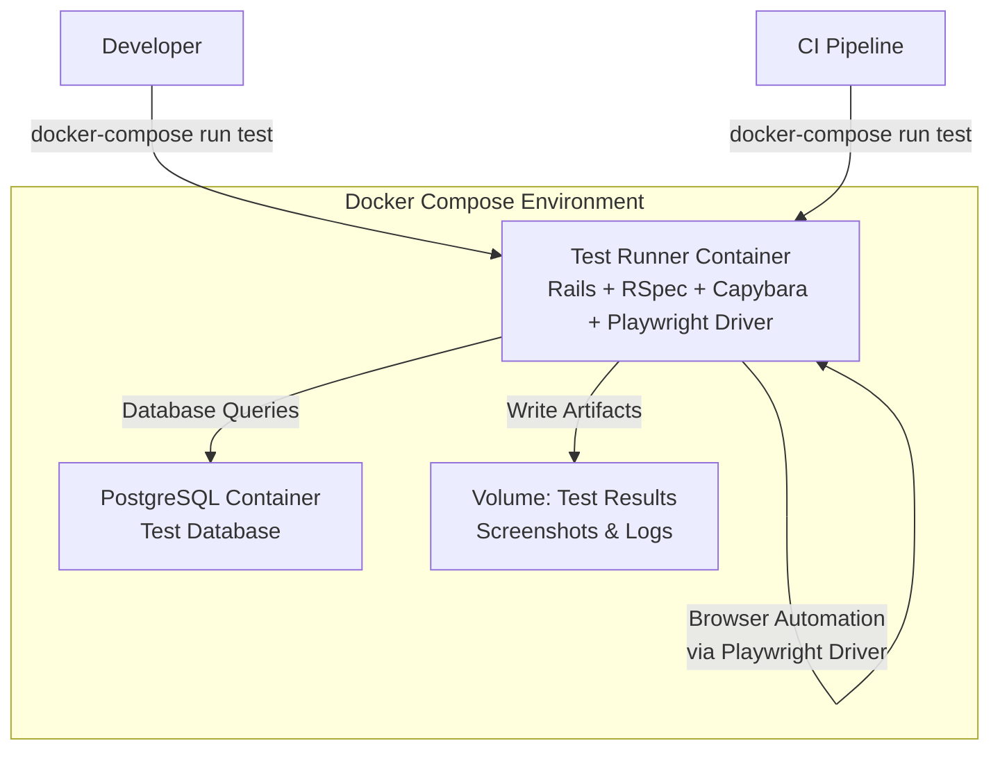

# Design Document: E2E Testing in Containers

## Overview

This document outlines the architecture and implementation approach for running end-to-end tests in a containerized environment using Capybara with Playwright driver. The solution uses Docker Compose to orchestrate multiple services (Rails app and PostgreSQL database), with Playwright driver integrated into Capybara for lightweight and fast browser automation.

The design leverages Playwright's modern browser automation capabilities through Capybara's familiar API, eliminating the need for a separate Selenium container while maintaining existing test code compatibility. This approach provides better performance and simpler infrastructure without requiring changes to existing Capybara-based tests.

## Architecture

### System Components



### Container Architecture

1. **Test Runner Container**: Runs the Rails application in test mode with RSpec, Capybara, and Playwright driver
   - Based on the existing Dockerfile with test-specific modifications
   - Includes all gems from the test group
   - Playwright browsers installed directly in the container
   - Capybara continues to provide the test DSL
   - No separate browser container needed

2. **Database Container**: Isolated PostgreSQL instance for tests
   - Separate from development database
   - Automatically created and migrated before tests
   - Data is ephemeral (destroyed after test run)

3. **Shared Volumes**: Persist test artifacts
   - Screenshots from failed tests
   - Test coverage reports
   - Log files for debugging

## Components and Interfaces

### Docker Compose Configuration

**File**: `docker-compose.test.yml`

```yaml
services:
  db:
    image: postgres:15
    environment:
      POSTGRES_PASSWORD: test_password
      POSTGRES_DB: attendance_test
    volumes:
      - postgres_test_data:/var/lib/postgresql/data
    healthcheck:
      test: ["CMD-SHELL", "pg_isready -U postgres"]
      interval: 5s
      timeout: 5s
      retries: 5

  test:
    build:
      context: .
      dockerfile: Dockerfile.test
    depends_on:
      db:
        condition: service_healthy
    environment:
      RAILS_ENV: test
      DATABASE_URL: postgresql://postgres:test_password@db:5432/attendance_test
      TIME_CARD_PASSWORD: ${TIME_CARD_PASSWORD}
      PLAYWRIGHT_BROWSERS_PATH: /ms-playwright
    volumes:
      - .:/rails
      - test_results:/rails/tmp/test_results
      - bundle_cache:/usr/local/bundle
      - playwright_cache:/ms-playwright
    command: bundle exec rspec
```

### Test-Specific Dockerfile

**File**: `Dockerfile.test`

```dockerfile
FROM ruby:3.3.1-slim

WORKDIR /rails

# Install dependencies for testing including Playwright requirements
RUN apt-get update -qq && \
    apt-get install --no-install-recommends -y \
    build-essential \
    git \
    libpq-dev \
    libvips \
    nodejs \
    npm \
    postgresql-client \
    # Playwright dependencies
    libnss3 \
    libnspr4 \
    libatk1.0-0 \
    libatk-bridge2.0-0 \
    libcups2 \
    libdrm2 \
    libdbus-1-3 \
    libxkbcommon0 \
    libxcomposite1 \
    libxdamage1 \
    libxfixes3 \
    libxrandr2 \
    libgbm1 \
    libasound2 \
    libpango-1.0-0 \
    libcairo2 && \
    rm -rf /var/lib/apt/lists/*

# Install gems
COPY Gemfile Gemfile.lock ./
RUN bundle install

# Install Playwright and browsers
RUN npm install -g playwright && \
    playwright install chromium --with-deps

# Copy application code
COPY . .

# Precompile assets for test environment
RUN RAILS_ENV=test bundle exec rails assets:precompile

# Setup entrypoint
COPY docker-entrypoint-test.sh /usr/bin/
RUN chmod +x /usr/bin/docker-entrypoint-test.sh
ENTRYPOINT ["docker-entrypoint-test.sh"]

CMD ["bundle", "exec", "rspec"]
```

### Test Entrypoint Script

**File**: `docker-entrypoint-test.sh`

```bash
#!/bin/bash
set -e

# Wait for database
echo "Waiting for database..."
until PGPASSWORD=$POSTGRES_PASSWORD psql -h db -U postgres -c '\q'; do
  echo "Database is unavailable - sleeping"
  sleep 1
done

echo "Database is up - setting up test database"

# Setup test database
bundle exec rails db:test:prepare

# Create test results directory
mkdir -p tmp/test_results

# Execute the main command
exec "$@"
```

### RSpec Configuration for Capybara with Playwright Driver

**File**: `spec/support/capybara.rb`

```ruby
require 'capybara/rspec'
require 'capybara/playwright'

# Register Playwright driver for Capybara
Capybara.register_driver :playwright do |app|
  Capybara::Playwright::Driver.new(app,
    browser_type: :chromium,
    headless: true,
    playwright_cli_executable_path: 'playwright',
    browser_options: {
      args: [
        '--no-sandbox',
        '--disable-dev-shm-usage',
        '--disable-gpu'
      ]
    },
    screen: {
      width: 1920,
      height: 1080
    }
  )
end

# Configure Capybara to use Playwright driver
Capybara.default_driver = :playwright
Capybara.javascript_driver = :playwright

# Configure Capybara server for container networking
Capybara.server_host = '0.0.0.0'
Capybara.server_port = 3000
Capybara.app_host = "http://#{IPSocket.getaddress(Socket.gethostname)}:3000"

# Configure wait times
Capybara.default_max_wait_time = 10

# Screenshot configuration
Capybara.save_path = 'tmp/test_results'

# Automatically save screenshots on failure
RSpec.configure do |config|
  config.after(:each, type: :system) do |example|
    if example.exception
      meta = example.metadata
      filename = File.basename(meta[:file_path])
      line_number = meta[:line_number]
      screenshot_name = "screenshot-#{filename}-#{line_number}.png"
      
      page.save_screenshot(screenshot_name)
      puts "Screenshot saved to #{Capybara.save_path}/#{screenshot_name}"
    end
  end
end
```

### System Test Helper

**File**: `spec/support/system_test_helper.rb`

```ruby
module SystemTestHelper
  def sign_in_with_basic_auth
    username = 'skuroki'
    password = ENV['TIME_CARD_PASSWORD']
    
    # Set basic auth for Capybara
    page.driver.browser.add_init_script("
      const username = '#{username}';
      const password = '#{password}';
      const auth = 'Basic ' + btoa(username + ':' + password);
      
      Object.defineProperty(window, 'authHeader', {
        get: () => auth
      });
    ")
  end

  def wait_for_turbo
    # Wait for Turbo progress bar to disappear
    expect(page).not_to have_selector('.turbo-progress-bar', wait: 10)
  rescue Capybara::ElementNotFound
    # Progress bar might not appear for fast requests
  end
end

RSpec.configure do |config|
  config.include SystemTestHelper, type: :system
end
```

## Data Models

### Test Data Management

The system uses RSpec's transactional fixtures by default, with the following configuration:

```ruby
# spec/rails_helper.rb
RSpec.configure do |config|
  config.use_transactional_fixtures = true
  
  # For system tests that use JavaScript, disable transactional fixtures
  config.before(:each, type: :system) do
    driven_by :playwright
    config.use_transactional_fixtures = false
  end
  
  # Use database_cleaner for system tests
  config.before(:each, type: :system) do
    DatabaseCleaner.strategy = :truncation
    DatabaseCleaner.start
  end
  
  config.after(:each, type: :system) do
    DatabaseCleaner.clean
  end
end
```

### Test Factories

Use FactoryBot for creating test data:

```ruby
# spec/factories/attendances.rb
FactoryBot.define do
  factory :attendance do
    work_date { Date.current }
    started_at { Time.current }
    
    trait :with_clock_out do
      after(:create) do |attendance|
        create(:clock_out, attendance: attendance)
      end
    end
    
    trait :with_rest do
      after(:create) do |attendance|
        create(:rest, attendance: attendance)
      end
    end
  end
end
```

## Correctness Properties

*A property is a characteristic or behavior that should hold true across all valid executions of a system—essentially, a formal statement about what the system should do. Properties serve as the bridge between human-readable specifications and machine-verifiable correctness guarantees.*


### Property 1: Container Exit Status Reflects Test Results

*For any* test execution in a container, the container exit code should be 0 if all tests pass and non-zero if any test fails.

**Validates: Requirements 1.4**

### Property 2: Screenshot Preservation on Failure

*For any* system test that fails, the system should automatically save a screenshot in the test results directory.

**Validates: Requirements 2.3, 2.5, 5.3**

### Property 3: Parallel Test Isolation

*For any* set of tests running in parallel, each test should execute in isolation without interfering with other concurrent tests (no shared state corruption).

**Validates: Requirements 2.4**

### Property 4: Test Database Idempotence

*For any* test suite execution, running the tests multiple times should produce the same results, with the database returning to a clean state before each run.

**Validates: Requirements 4.1, 4.4**

### Property 5: Transactional Rollback

*For any* non-system test that modifies the database, all changes should be automatically rolled back after the test completes, leaving no persistent data.

**Validates: Requirements 4.2**

### Property 6: Temporary File Cleanup

*For any* test that creates temporary files or uploads, those files should be automatically removed after the test completes.

**Validates: Requirements 4.3**

### Property 7: Browser Operation Retry

*For any* browser operation (page navigation, element interaction) that fails due to transient issues, the system should automatically retry with exponential backoff up to a configured maximum.

**Validates: Requirements 7.2**

### Property 8: Timeout Diagnostic Information

*For any* test that times out, the error message should include diagnostic information such as the last known state, pending operations, and relevant logs.

**Validates: Requirements 7.5**

### Property 9: Test Failure Error Messages

*For any* failing test, the system should provide a complete error message including the failure reason, stack trace, and context about the test state.

**Validates: Requirements 8.5**

## Error Handling

### Container Startup Failures

**Database Connection Errors**:
- The entrypoint script waits for PostgreSQL to be ready using health checks
- If the database is not available after 30 seconds, the container exits with code 1
- Error message includes connection details for debugging

**Missing Environment Variables**:
- Required environment variables (TIME_CARD_PASSWORD, DATABASE_URL) are validated at startup
- Missing variables cause immediate failure with descriptive error messages
- The .env.test file provides defaults for development

### Test Execution Errors

**Browser Timeout Errors**:
- Capybara default timeout is set to 10 seconds
- Explicit waits can be used for longer operations
- Timeout errors include the selector that was being waited for

**Database Lock Errors**:
- System tests use database_cleaner with truncation strategy to avoid locks
- If locks occur, tests retry with exponential backoff
- Persistent locks cause test failure with diagnostic information

**Screenshot Capture Failures**:
- If screenshot capture fails, the error is logged but doesn't fail the test
- Screenshots are saved to a mounted volume for persistence
- Fallback to page HTML snapshot if screenshot fails

### Resource Cleanup

**Container Cleanup**:
```bash
# Cleanup script for CI environments
docker-compose -f docker-compose.test.yml down -v
docker system prune -f
```

**Volume Cleanup**:
- Test database volume is destroyed after test run
- Test results volume persists for artifact collection
- Temporary files are cleaned up by the entrypoint script

## Testing Strategy

### Dual Testing Approach

The system uses both unit tests and property-based tests for comprehensive coverage:

**Unit Tests**:
- Verify specific examples of container configuration
- Test individual helper methods and utilities
- Validate specific test scenarios (clock-in, clock-out, reports)
- Check error handling for known edge cases

**Property-Based Tests**:
- Verify universal properties across all test executions
- Test isolation and idempotence properties
- Validate retry and error handling behavior
- Ensure artifact preservation across different failure modes

### Property-Based Testing Configuration

The system uses RSpec with custom property test helpers:

```ruby
# spec/support/property_testing.rb
module PropertyTesting
  def property_test(description, iterations: 100, &block)
    it description do
      iterations.times do |i|
        instance_exec(i, &block)
      end
    end
  end
end

RSpec.configure do |config|
  config.include PropertyTesting
end
```

Each property test runs a minimum of 100 iterations to ensure reliability. Property tests are tagged with their corresponding design property:

```ruby
# Example property test
RSpec.describe 'Container Exit Status', type: :integration do
  property_test 'exits with correct status code', iterations: 100 do |i|
    # Feature: e2e-testing-in-containers, Property 1: Container Exit Status Reflects Test Results
    
    # Generate random test scenario
    test_file = create_random_test_file(pass: i.even?)
    
    # Run test in container
    result = run_in_container("bundle exec rspec #{test_file}")
    
    # Verify exit code matches test result
    if i.even?
      expect(result.exit_code).to eq(0)
    else
      expect(result.exit_code).not_to eq(0)
    end
  end
end
```

### System Test Examples

**Attendance Workflow Test**:
```ruby
# spec/system/attendance_workflow_spec.rb
RSpec.describe 'Attendance Workflow', type: :system do
  before do
    sign_in_with_basic_auth
  end

  it 'allows user to clock in, take rest, and clock out' do
    visit attendances_path
    
    # Clock in
    click_button '出勤'
    expect(page).to have_content('出勤時刻')
    
    # Start rest
    click_button '休憩開始'
    expect(page).to have_content('休憩中')
    
    # End rest
    click_button '休憩終了'
    expect(page).to have_content('勤務中')
    
    # Clock out
    click_button '退勤'
    expect(page).to have_content('退勤時刻')
  end
end
```

**Report Page Test**:
```ruby
# spec/system/report_page_spec.rb
RSpec.describe 'Report Page', type: :system do
  before do
    sign_in_with_basic_auth
    create_list(:attendance, 10, :with_clock_out)
  end

  it 'displays attendance records for the current month' do
    visit report_attendances_path
    
    expect(page).to have_selector('table tbody tr', count: 10)
    expect(page).to have_content('勤務時間')
    expect(page).to have_content('休憩時間')
  end

  it 'filters records by month' do
    old_attendance = create(:attendance, work_date: 2.months.ago)
    
    visit report_attendances_path
    
    expect(page).not_to have_content(old_attendance.work_date.to_s)
  end
end
```

### Test Execution Commands

**Run all tests**:
```bash
docker-compose -f docker-compose.test.yml run --rm test
```

**Run specific test file**:
```bash
docker-compose -f docker-compose.test.yml run --rm test bundle exec rspec spec/system/attendance_workflow_spec.rb
```

**Run with coverage**:
```bash
docker-compose -f docker-compose.test.yml run --rm -e COVERAGE=true test
```

**Run in watch mode**:
```bash
docker-compose -f docker-compose.test.yml run --rm test bundle exec guard
```

**Debug with pry**:
```bash
docker-compose -f docker-compose.test.yml run --rm test bundle exec rspec spec/system/attendance_workflow_spec.rb
# Add binding.pry in test code, then attach to container:
docker attach <container_id>
```

### CI Integration

**GitHub Actions Example**:
```yaml
name: E2E Tests

on: [push, pull_request]

jobs:
  test:
    runs-on: ubuntu-latest
    
    steps:
      - uses: actions/checkout@v3
      
      - name: Set up Docker Buildx
        uses: docker/setup-buildx-action@v2
      
      - name: Run E2E tests
        env:
          TIME_CARD_PASSWORD: ${{ secrets.TIME_CARD_PASSWORD }}
        run: |
          docker-compose -f docker-compose.test.yml run --rm test
      
      - name: Upload test artifacts
        if: failure()
        uses: actions/upload-artifact@v3
        with:
          name: test-results
          path: tmp/test_results/
```

### Performance Targets

- Full test suite execution: < 5 minutes
- Individual system test: < 30 seconds
- Container startup time: < 30 seconds
- Database setup time: < 10 seconds

### Test Organization

```
spec/
├── system/                    # E2E tests using Capybara
│   ├── attendance_workflow_spec.rb
│   ├── report_page_spec.rb
│   └── authentication_spec.rb
├── support/
│   ├── capybara.rb           # Capybara with Playwright driver configuration
│   ├── system_test_helper.rb # System test helpers
│   ├── property_testing.rb   # Property test helpers
│   └── database_cleaner.rb   # Database cleanup configuration
└── factories/                 # FactoryBot factories
    ├── attendances.rb
    ├── clock_outs.rb
    └── rests.rb
```
