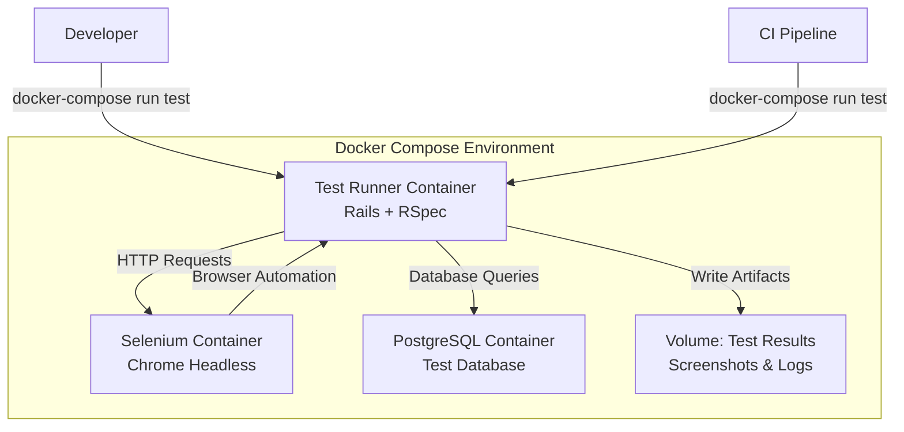

# Design Document: E2E Testing in Containers

## Overview

This design document outlines the architecture and implementation approach for running end-to-end tests in a containerized environment. The solution uses Docker Compose to orchestrate multiple services (Rails app, PostgreSQL database, and Selenium browser), enabling consistent and isolated test execution across development, CI, and production-like environments.

The design leverages existing tools (RSpec, Capybara, Selenium WebDriver) while adding container orchestration and configuration to support headless browser testing in Docker.

## Architecture

### System Components



### Container Architecture

1. **Test Runner Container**: Runs the Rails application in test mode with RSpec
   - Based on the existing Dockerfile with test-specific modifications
   - Includes all gems from the test group
   - Configured to connect to external Selenium and database services

2. **Selenium Container**: Provides browser automation capabilities
   - Uses official Selenium standalone Chrome image
   - Runs Chrome in headless mode
   - Exposes port 4444 for WebDriver connections

3. **Database Container**: Isolated PostgreSQL instance for tests
   - Separate from development database
   - Automatically created and migrated before tests
   - Data is ephemeral (destroyed after test run)

4. **Shared Volumes**: Persist test artifacts
   - Screenshots from failed tests
   - Test coverage reports
   - Log files for debugging

## Components and Interfaces

### Docker Compose Configuration

**File**: `docker-compose.test.yml`

```yaml
services:
  db:
    image: postgres:15
    environment:
      POSTGRES_PASSWORD: test_password
      POSTGRES_DB: attendance_test
    volumes:
      - postgres_test_data:/var/lib/postgresql/data
    healthcheck:
      test: ["CMD-SHELL", "pg_isready -U postgres"]
      interval: 5s
      timeout: 5s
      retries: 5

  selenium:
    image: selenium/standalone-chrome:latest
    shm_size: 2gb
    ports:
      - "4444:4444"
      - "7900:7900"  # VNC port for debugging
    environment:
      - SE_NODE_MAX_SESSIONS=5
      - SE_NODE_SESSION_TIMEOUT=300

  test:
    build:
      context: .
      dockerfile: Dockerfile.test
    depends_on:
      db:
        condition: service_healthy
      selenium:
        condition: service_started
    environment:
      RAILS_ENV: test
      DATABASE_URL: postgresql://postgres:test_password@db:5432/attendance_test
      SELENIUM_REMOTE_URL: http://selenium:4444/wd/hub
      TIME_CARD_PASSWORD: ${TIME_CARD_PASSWORD}
    volumes:
      - .:/rails
      - test_results:/rails/tmp/test_results
      - bundle_cache:/usr/local/bundle
    command: bundle exec rspec
```

### Test-Specific Dockerfile

**File**: `Dockerfile.test`

```dockerfile
FROM ruby:3.3.1-slim

WORKDIR /rails

# Install dependencies for testing
RUN apt-get update -qq && \
    apt-get install --no-install-recommends -y \
    build-essential \
    git \
    libpq-dev \
    libvips \
    nodejs \
    postgresql-client && \
    rm -rf /var/lib/apt/lists/*

# Install gems
COPY Gemfile Gemfile.lock ./
RUN bundle install

# Copy application code
COPY . .

# Precompile assets for test environment
RUN RAILS_ENV=test bundle exec rails assets:precompile

# Setup entrypoint
COPY docker-entrypoint-test.sh /usr/bin/
RUN chmod +x /usr/bin/docker-entrypoint-test.sh
ENTRYPOINT ["docker-entrypoint-test.sh"]

CMD ["bundle", "exec", "rspec"]
```

### Test Entrypoint Script

**File**: `docker-entrypoint-test.sh`

```bash
#!/bin/bash
set -e

# Wait for database
echo "Waiting for database..."
until PGPASSWORD=$POSTGRES_PASSWORD psql -h db -U postgres -c '\q'; do
  echo "Database is unavailable - sleeping"
  sleep 1
done

echo "Database is up - setting up test database"

# Setup test database
bundle exec rails db:test:prepare

# Create test results directory
mkdir -p tmp/test_results

# Execute the main command
exec "$@"
```

### RSpec Configuration for Containers

**File**: `spec/support/capybara.rb`

```ruby
require 'capybara/rspec'
require 'selenium-webdriver'

Capybara.register_driver :selenium_remote_chrome do |app|
  options = Selenium::WebDriver::Chrome::Options.new
  options.add_argument('--headless')
  options.add_argument('--no-sandbox')
  options.add_argument('--disable-dev-shm-usage')
  options.add_argument('--disable-gpu')
  options.add_argument('--window-size=1920,1080')

  Capybara::Selenium::Driver.new(
    app,
    browser: :remote,
    url: ENV['SELENIUM_REMOTE_URL'] || 'http://selenium:4444/wd/hub',
    options: options
  )
end

Capybara.configure do |config|
  config.default_driver = :rack_test
  config.javascript_driver = :selenium_remote_chrome
  config.default_max_wait_time = 10
  config.server = :puma, { Silent: true }
  
  # Configure server host for container networking
  config.server_host = '0.0.0.0'
  config.server_port = 3000
  config.app_host = "http://#{IPSocket.getaddress(Socket.gethostname)}:3000"
end

# Save screenshots on failure
RSpec.configure do |config|
  config.after(:each, type: :system) do |example|
    if example.exception
      meta = example.metadata
      filename = File.basename(meta[:file_path])
      line_number = meta[:line_number]
      screenshot_name = "screenshot-#{filename}-#{line_number}.png"
      screenshot_path = "tmp/test_results/#{screenshot_name}"
      
      page.save_screenshot(screenshot_path)
      puts "Screenshot saved to #{screenshot_path}"
    end
  end
end
```

### System Test Helper

**File**: `spec/support/system_test_helper.rb`

```ruby
module SystemTestHelper
  def sign_in_with_basic_auth
    username = 'skuroki'
    password = ENV['TIME_CARD_PASSWORD']
    
    page.driver.browser.manage.add_cookie(
      name: 'auth',
      value: Base64.strict_encode64("#{username}:#{password}")
    )
  end

  def wait_for_ajax
    Timeout.timeout(Capybara.default_max_wait_time) do
      loop until page.evaluate_script('jQuery.active').zero?
    end
  end

  def wait_for_turbo
    expect(page).to have_no_css('.turbo-progress-bar', wait: 5)
  end
end

RSpec.configure do |config|
  config.include SystemTestHelper, type: :system
end
```

## Data Models

### Test Data Management

The system uses RSpec's transactional fixtures by default, with the following configuration:

```ruby
# spec/rails_helper.rb
RSpec.configure do |config|
  config.use_transactional_fixtures = true
  
  # For system tests that use JavaScript, disable transactional fixtures
  config.before(:each, type: :system) do
    driven_by :selenium_remote_chrome
    config.use_transactional_fixtures = false
  end
  
  # Use database_cleaner for system tests
  config.before(:each, type: :system) do
    DatabaseCleaner.strategy = :truncation
    DatabaseCleaner.start
  end
  
  config.after(:each, type: :system) do
    DatabaseCleaner.clean
  end
end
```

### Test Factories

Use FactoryBot for creating test data:

```ruby
# spec/factories/attendances.rb
FactoryBot.define do
  factory :attendance do
    work_date { Date.current }
    started_at { Time.current }
    
    trait :with_clock_out do
      after(:create) do |attendance|
        create(:clock_out, attendance: attendance)
      end
    end
    
    trait :with_rest do
      after(:create) do |attendance|
        create(:rest, attendance: attendance)
      end
    end
  end
end
```

## Correctness Properties

*A property is a characteristic or behavior that should hold true across all valid executions of a system—essentially, a formal statement about what the system should do. Properties serve as the bridge between human-readable specifications and machine-verifiable correctness guarantees.*


### Property 1: Container Exit Status Reflects Test Results

*For any* test execution in a container, the container exit code should be 0 if all tests pass and non-zero if any test fails.

**Validates: Requirements 1.4**

### Property 2: Screenshot and Log Preservation on Failure

*For any* system test that fails, the system should automatically save a screenshot and preserve relevant logs in the test results directory.

**Validates: Requirements 2.3, 2.5, 5.3**

### Property 3: Parallel Test Isolation

*For any* set of tests running in parallel, each test should execute in isolation without interfering with other concurrent tests (no shared state corruption).

**Validates: Requirements 2.4**

### Property 4: Test Database Idempotence

*For any* test suite execution, running the tests multiple times should produce the same results, with the database returning to a clean state before each run.

**Validates: Requirements 4.1, 4.4**

### Property 5: Transactional Rollback

*For any* non-system test that modifies the database, all changes should be automatically rolled back after the test completes, leaving no persistent data.

**Validates: Requirements 4.2**

### Property 6: Temporary File Cleanup

*For any* test that creates temporary files or uploads, those files should be automatically removed after the test completes.

**Validates: Requirements 4.3**

### Property 7: Network Operation Retry

*For any* network operation (HTTP requests, Selenium commands) that fails due to transient issues, the system should automatically retry with exponential backoff up to a configured maximum.

**Validates: Requirements 7.2**

### Property 8: Timeout Diagnostic Information

*For any* test that times out, the error message should include diagnostic information such as the last known state, pending operations, and relevant logs.

**Validates: Requirements 7.5**

### Property 9: Test Failure Error Messages

*For any* failing test, the system should provide a complete error message including the failure reason, stack trace, and context about the test state.

**Validates: Requirements 8.5**

## Error Handling

### Container Startup Failures

**Database Connection Errors**:
- The entrypoint script waits for PostgreSQL to be ready using health checks
- If the database is not available after 30 seconds, the container exits with code 1
- Error message includes connection details for debugging

**Selenium Connection Errors**:
- Capybara is configured with retry logic for Selenium connections
- If Selenium is not available, tests fail with a clear error message
- The docker-compose configuration ensures Selenium starts before tests

**Missing Environment Variables**:
- Required environment variables (TIME_CARD_PASSWORD, DATABASE_URL) are validated at startup
- Missing variables cause immediate failure with descriptive error messages
- The .env.test file provides defaults for development

### Test Execution Errors

**Browser Timeout Errors**:
- Capybara default wait time is set to 10 seconds
- Explicit waits can be used for longer operations
- Timeout errors include the selector that was being waited for

**Database Lock Errors**:
- System tests use database_cleaner with truncation strategy to avoid locks
- If locks occur, tests retry with exponential backoff
- Persistent locks cause test failure with diagnostic information

**Screenshot Capture Failures**:
- If screenshot capture fails, the error is logged but doesn't fail the test
- Screenshots are saved to a mounted volume for persistence
- Fallback to HTML snapshot if screenshot fails

### Resource Cleanup

**Container Cleanup**:
```bash
# Cleanup script for CI environments
docker-compose -f docker-compose.test.yml down -v
docker system prune -f
```

**Volume Cleanup**:
- Test database volume is destroyed after test run
- Test results volume persists for artifact collection
- Temporary files are cleaned up by the entrypoint script

## Testing Strategy

### Dual Testing Approach

The system uses both unit tests and property-based tests for comprehensive coverage:

**Unit Tests**:
- Verify specific examples of container configuration
- Test individual helper methods and utilities
- Validate specific test scenarios (clock-in, clock-out, reports)
- Check error handling for known edge cases

**Property-Based Tests**:
- Verify universal properties across all test executions
- Test isolation and idempotence properties
- Validate retry and error handling behavior
- Ensure artifact preservation across different failure modes

### Property-Based Testing Configuration

The system uses RSpec with custom property test helpers:

```ruby
# spec/support/property_testing.rb
module PropertyTesting
  def property_test(description, iterations: 100, &block)
    it description do
      iterations.times do |i|
        instance_exec(i, &block)
      end
    end
  end
end

RSpec.configure do |config|
  config.include PropertyTesting
end
```

Each property test runs a minimum of 100 iterations to ensure reliability. Property tests are tagged with their corresponding design property:

```ruby
# Example property test
RSpec.describe 'Container Exit Status', type: :integration do
  property_test 'exits with correct status code', iterations: 100 do |i|
    # Feature: e2e-testing-in-containers, Property 1: Container Exit Status Reflects Test Results
    
    # Generate random test scenario
    test_file = create_random_test_file(pass: i.even?)
    
    # Run test in container
    result = run_in_container("bundle exec rspec #{test_file}")
    
    # Verify exit code matches test result
    if i.even?
      expect(result.exit_code).to eq(0)
    else
      expect(result.exit_code).not_to eq(0)
    end
  end
end
```

### System Test Examples

**Attendance Workflow Test**:
```ruby
# spec/system/attendance_workflow_spec.rb
RSpec.describe 'Attendance Workflow', type: :system do
  before do
    sign_in_with_basic_auth
  end

  it 'allows user to clock in, take rest, and clock out' do
    visit attendances_path
    
    # Clock in
    click_button '出勤'
    expect(page).to have_content '出勤時刻'
    
    # Start rest
    click_button '休憩開始'
    expect(page).to have_content '休憩中'
    
    # End rest
    click_button '休憩終了'
    expect(page).to have_content '勤務中'
    
    # Clock out
    click_button '退勤'
    expect(page).to have_content '退勤時刻'
  end
end
```

**Report Page Test**:
```ruby
# spec/system/report_page_spec.rb
RSpec.describe 'Report Page', type: :system do
  before do
    sign_in_with_basic_auth
    create_list(:attendance, 10, :with_clock_out)
  end

  it 'displays attendance records for the current month' do
    visit report_attendances_path
    
    expect(page).to have_selector('table tbody tr', count: 10)
    expect(page).to have_content '勤務時間'
    expect(page).to have_content '休憩時間'
  end

  it 'filters records by month' do
    old_attendance = create(:attendance, work_date: 2.months.ago)
    
    visit report_attendances_path
    
    expect(page).not_to have_content old_attendance.work_date.to_s
  end
end
```

### Test Execution Commands

**Run all tests**:
```bash
docker-compose -f docker-compose.test.yml run --rm test
```

**Run specific test file**:
```bash
docker-compose -f docker-compose.test.yml run --rm test bundle exec rspec spec/system/attendance_workflow_spec.rb
```

**Run with coverage**:
```bash
docker-compose -f docker-compose.test.yml run --rm -e COVERAGE=true test
```

**Run in watch mode**:
```bash
docker-compose -f docker-compose.test.yml run --rm test bundle exec guard
```

**Debug with pry**:
```bash
docker-compose -f docker-compose.test.yml run --rm test bundle exec rspec spec/system/attendance_workflow_spec.rb
# Add binding.pry in test code, then attach to container:
docker attach <container_id>
```

### CI Integration

**GitHub Actions Example**:
```yaml
name: E2E Tests

on: [push, pull_request]

jobs:
  test:
    runs-on: ubuntu-latest
    
    steps:
      - uses: actions/checkout@v3
      
      - name: Set up Docker Buildx
        uses: docker/setup-buildx-action@v2
      
      - name: Run E2E tests
        env:
          TIME_CARD_PASSWORD: ${{ secrets.TIME_CARD_PASSWORD }}
        run: |
          docker-compose -f docker-compose.test.yml run --rm test
      
      - name: Upload test artifacts
        if: failure()
        uses: actions/upload-artifact@v3
        with:
          name: test-results
          path: tmp/test_results/
```

### Performance Targets

- Full test suite execution: < 5 minutes
- Individual system test: < 30 seconds
- Container startup time: < 30 seconds
- Database setup time: < 10 seconds

### Test Organization

```
spec/
├── system/                    # E2E tests using Capybara
│   ├── attendance_workflow_spec.rb
│   ├── report_page_spec.rb
│   └── authentication_spec.rb
├── integration/               # Integration tests for container setup
│   ├── container_startup_spec.rb
│   ├── database_connection_spec.rb
│   └── selenium_connection_spec.rb
├── support/
│   ├── capybara.rb           # Capybara configuration
│   ├── system_test_helper.rb # System test helpers
│   ├── property_testing.rb   # Property test helpers
│   └── database_cleaner.rb   # Database cleanup configuration
└── factories/                 # FactoryBot factories
    ├── attendances.rb
    ├── clock_outs.rb
    └── rests.rb
```
